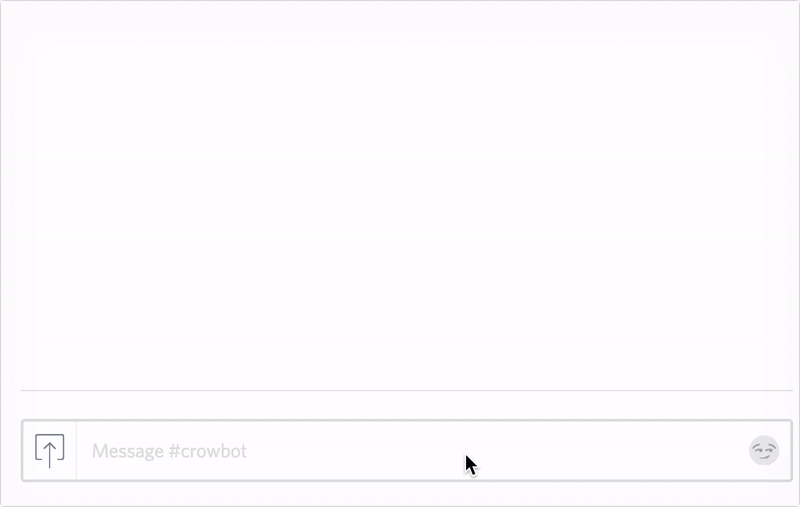

# crowbot 🐦🤖

`crowbot` is a useful Discord bot that lets you know whether there's a [Crowfall](https://www.crowfall.com/) (an upcoming fantasy MMORPG) playtest currently running, and what future playtests are [scheduled](https://www.crowfall.com/en/playtest-schedule/).

Commands:

* `!crowfall playtests` - Returns the current & upcoming Crowfall playtest schedule.
* `!crowfall playtest now` - is there a playtest running now?
* `!crowfall help` - Shows the help text.

Feature additions and/or suggestions are welcome. If ArtCraft offer an API for account and/or game data, crowbot will be extended to hook into these.

## Demo Time



## Use on your Discord channel

**[Add Crowbot to your Discord server(s)](https://discordapp.com/oauth2/authorize?client_id=301018179373760512&permissions=19456&scope=bot)**

Crowbot will show up in the members list as a "bot" and will respond commands it is aware of. You can add it to multiple servers (as long as you are an admin) and change which channels it is a member of via the Discord UI.

*Note*: This bot, like many others, works by reading message events from your preferred channel(s) by subscribing to an event stream from Discord. This *does* mean that the bot can read all messages in the channels it has been enabled for. Although communication is *only* over HTTPS (TLS) and/or secure WebSockets (WSS) and the bot does not log messages (it does log commands), there is always an element of trust (as with any bot!). If you don't trust this bot, you are welcome to deploy your own version of it or fork it and modify the source (noting the associated LICENSE file).

## Optional: Deploy to Heroku or Zeit Now

You can run this yourself by deploying to [Heroku](https://www.heroku.com/), [Now](https://zeit.co/now) or your own server. You will need:

* At least a cursory knowledge of [yarn](https://yarnpkg.com/en/) (or npm), git and TypeScript.
* To [create a bot](https://discordapp.com/developers/applications/me) application on Discord & obtain a client ID and bot token.
* A Google API key from [their developer console](https://console.developers.google.com/apis/dashboard) (to make requests to the Calendar API)

### Heroku

Deploying to Heroku is easy. If you haven't done it before, you should run through their [Node.js guide](https://devcenter.heroku.com/articles/getting-started-with-nodejs#introduction), which will familiarize you with their platform.

Beyond that: clone this repository, modify the `BotConfig` in `index.ts` to rename/change any configuration you want, and then add your keys as environmental variables t

```
$ heroku login
$ heroku apps:create $uniquename
$ heroku config:set DISCORD_BOT_TOKEN=yours
$ heroku config:set DISCORD_CLIENT_ID=yours
$ heroku config:set GOOGLE_API_KEY=yours
$ git push heroku
```

Use `heroku logs` if you need to inspect the running logs for the application.

## License

3-Clause-BSD licensed. See the LICENSE file for further details.
